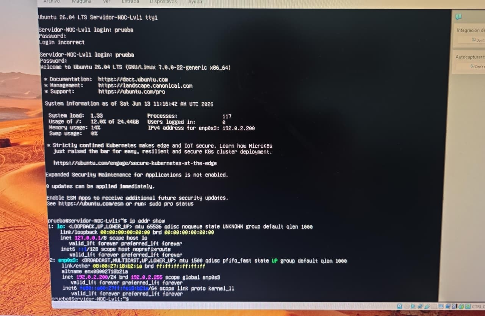
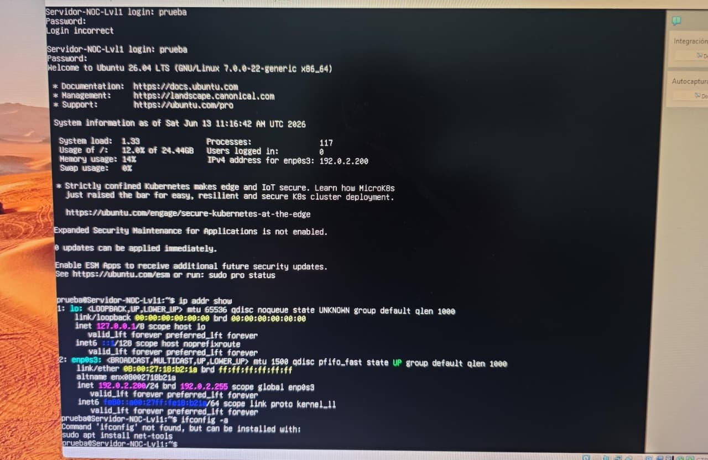
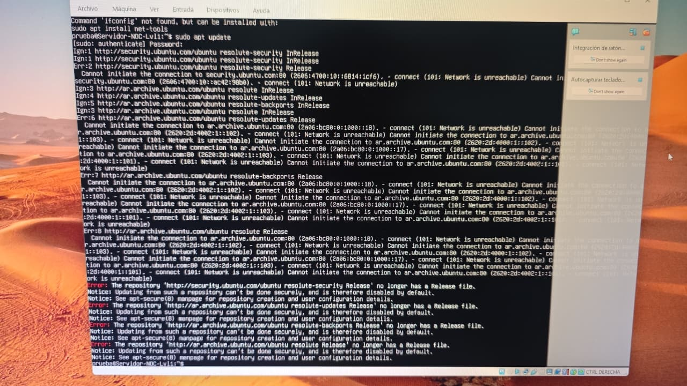
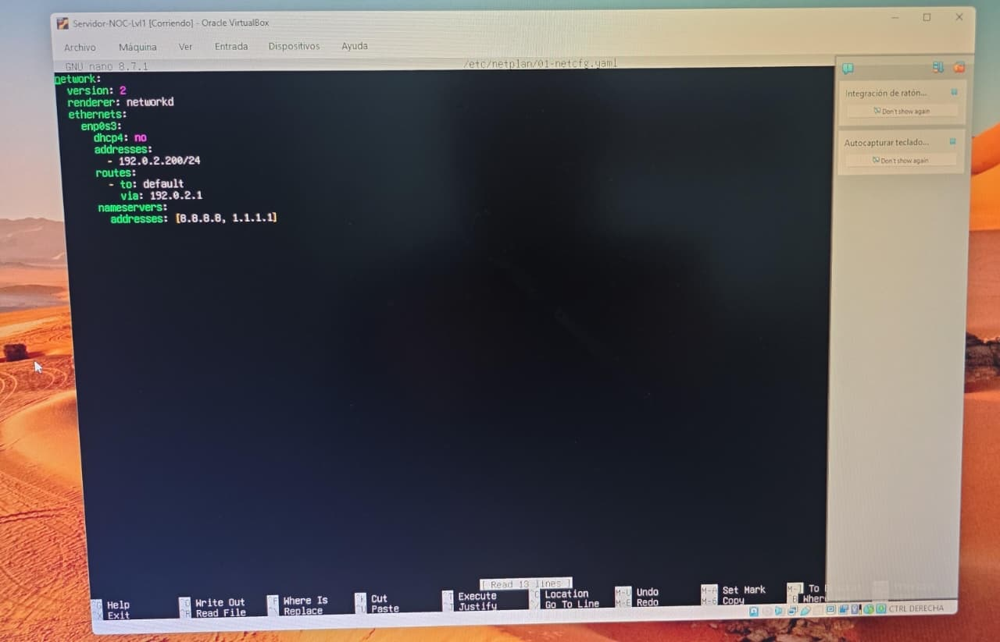
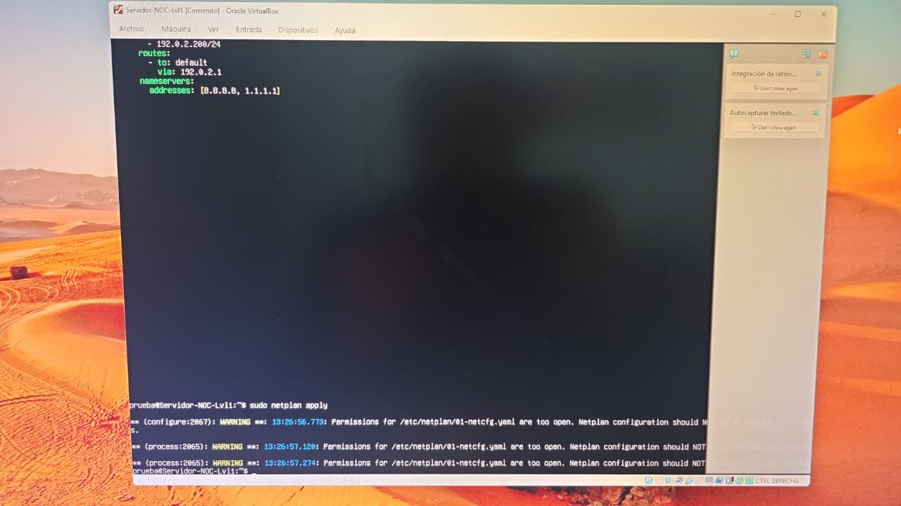
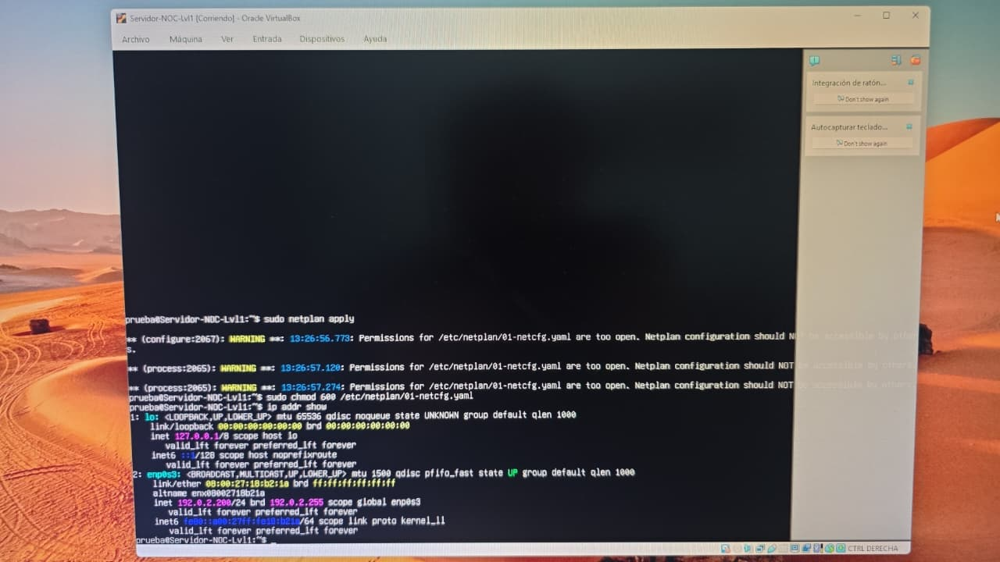
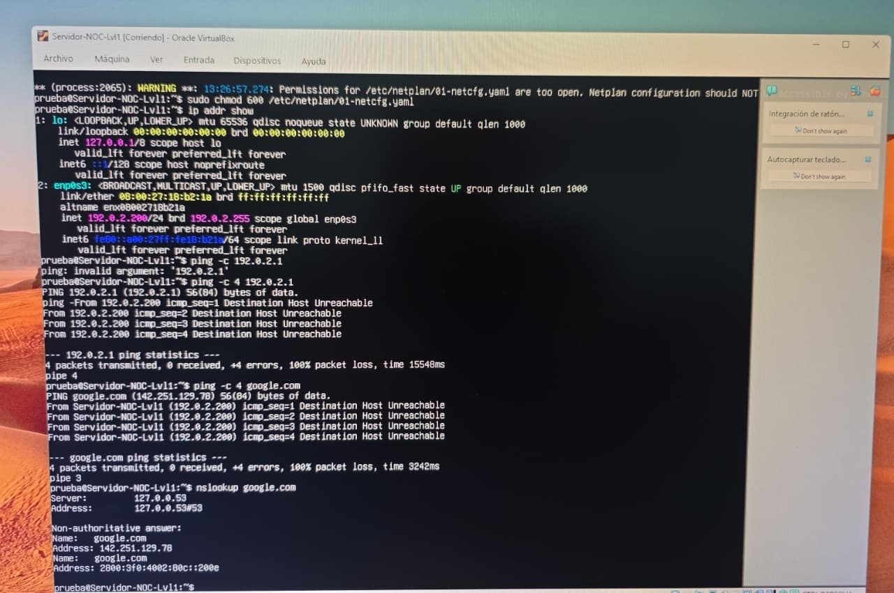
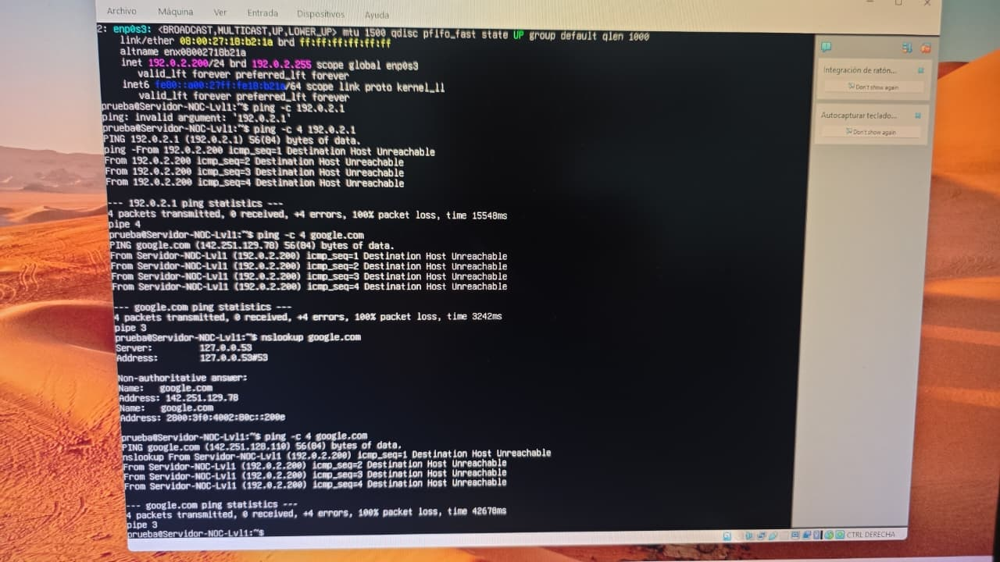

# 🌐 Configuración Básica de IP en Linux (Nivel 1)

Este práctico demuestra cómo un operador de nivel 1 puede:
- Ver la configuración de red.
- Cambiar la IP manualmente.
- Validar conectividad con ping y nslookup.

---

## 📊 Paso 1 – Configuración inicial

---

## 🛠️ Paso 2 – Intento de ifconfig

---

## 🛠️ Paso 3 – Edición de Netplan

---

## 📌 Paso 4 – Aplicar cambios

---

## 📊 Paso 5 – Validación
**Ping al gateway**

**Ping a Google**

**Prueba DNS**

**Ping repetido a Google**

---

## ✅ Observacion
Este ejercicio muestra que:
- La IP fija se configuró correctamente.  
- El ping al gateway y a Google falló → sin salida a Internet.  
- El DNS resolvió correctamente → servicio operativo.  

> 📌 Observación: El operador de nivel 1 documenta los resultados y escala la incidencia al área de redes para revisión.

### Conceptos básicos

- **[IP](ca://s?q=Que_es_una_IP_en_redes)**: número único que identifica un dispositivo en la red.  
- **[Máscara de red](ca://s?q=Que_es_una_mascara_de_red)**: define el rango de hosts disponibles dentro de la red.  
- **[Gateway](ca://s?q=Que_es_un_gateway_en_redes)**: dispositivo que conecta tu red local con otras redes (ej. Internet).  
- **[DNS](ca://s?q=Que_es_el_DNS_y_como_funciona)**: traduce nombres de dominio (google.com) a direcciones IP.

# 📂 Nombre del Proyecto Configuracion IP-Linux Noc Nivel 1

## 📌 Descripción
Breve explicación del laboratorio o práctica realizada.  
Ejemplo: Configuración de IP estática en Linux para entorno NOC Nivel 1.

## 🎯 Objetivos
- [Configurar IP estática](ca://s?q=Configurar_IP_estatica_en_Linux)
- [Validar conectividad con gateway](ca://s?q=Validar_conectividad_con_gateway_en_Linux)
- [Probar resolución DNS](ca://s?q=Probar_resolucion_DNS_en_Linux)
- [Documentar resultados](ca://s?q=Documentar_resultados_de_laboratorio_en_GitHub)

## 🧩 Comandos utilizados
- `ip addr show` → [Ver interfaces de red](ca://s?q=Comando_ip_addr_show_en_Linux)
- `sudo nano /etc/netplan/01-netcfg.yaml` → [Editar configuración Netplan](ca://s?q=Editar_archivo_netplan_en_Linux)
- `sudo netplan apply` → [Aplicar cambios de red](ca://s?q=Comando_netplan_apply_en_Linux)
- `ping -c 4 192.168.60.1` → [Validar conectividad con gateway](ca://s?q=Comando_ping_en_Linux)
- `ping -c 4 google.com` → [Probar conectividad externa](ca://s?q=Ping_a_google_en_Linux)
- `nslookup google.com` → [Comprobar resolución DNS](ca://s?q=Comando_nslookup_en_Linux)

## ✅ Validación
- Ping exitoso al gateway (`192.168.60.1`)  
- Ping exitoso a dominio externo (`google.com`)  
- DNS responde correctamente con `nslookup`

## 📷 Evidencias
Incluye capturas de pantalla de:
- Configuración aplicada en Netplan
- Resultados de ping y nslookup
- Estado de interfaces (`ip addr show`)

## 📚 Notas
Este laboratorio se ejecuta en máquina virtual Linux (Debian/Ubuntu).  
Forma parte de la serie de prácticas NOC Nivel 1 documentadas en mi portafolio GitHub.

  📊 Estadísticas y contadores
## 📈 Estadísticas de GitHub

### 🏁 Conclusión

El ejercicio demuestra que un operador de nivel 1 puede:
- Configurar IP, máscara y gateway en Linux.  
- Ejecutar pruebas de conectividad con ping y nslookup.  
- Interpretar resultados: IP correcta, DNS operativo, pero sin salida a Internet.  
- Documentar con capturas y observaciones claras.  

📌 Observación: Se recomienda escalar al área de redes para revisar la configuración de VirtualBox (NAT/Bridge) y asegurar conectividad externa.

Voy a subir la prueba nivel 2 para resolver el problema. 

* **💼 LinkedIn**: [Horacio Marcelo Nuñez]([https://linkedin.com](https://www.linkedin.com/in/marcelo-nunez-it/?skipRedirect=true)) 
* **📬 Correo Electrónico**: [marcelonh86@gmail.com](marcelonh86@gmail.com)
* **🚀 GitHub**: [@MarceloNunez-NOC](https://github.com/MarceloNunez-NOC)

---
*Desarrollado con dedicación y compromiso por la excelencia técnica.*
Agradezco el tiempo de quienes visitan mi portafolio en GitHub. Cada laboratorio refleja mi compromiso con el aprendizaje continuo y la práctica aplicada en IT, redes y administración de sistemas. Mi objetivo es demostrar que puedo diagnosticar, resolver y documentar incidentes de manera profesional, utilizando máquinas virtuales y configuraciones de red.

Invito a reclutadores y colegas a seguir mis repositorios, donde iré compartiendo nuevos proyectos, certificados y logros. Estoy abierto a colaborar y aportar mi experiencia en entornos que valoren la constancia y la capacidad de resolver problemas.

